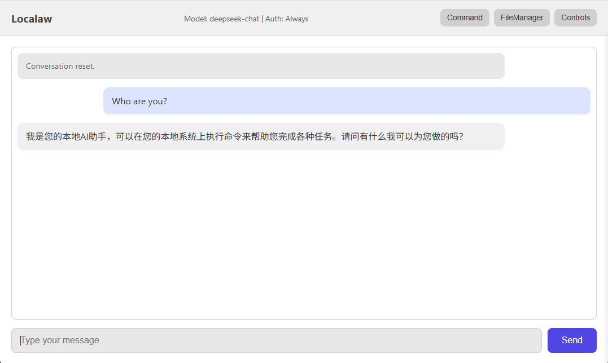
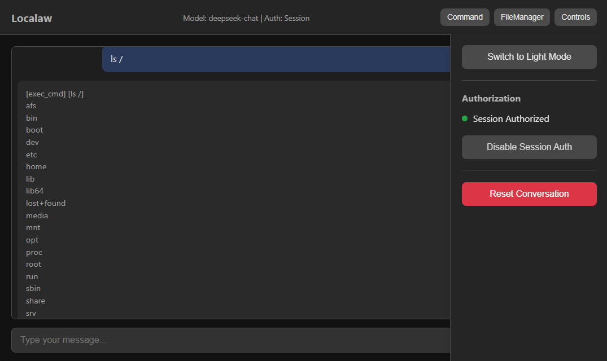
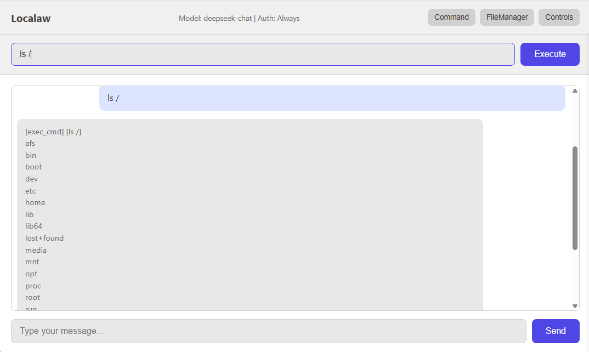
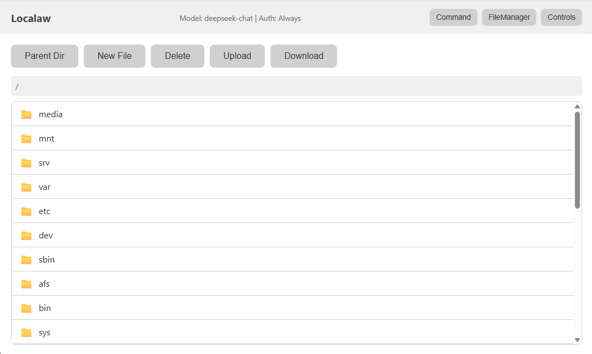

# Localaw

A local AI assistant that connects to remote LLM APIs and executes commands on your system.

[中文文档](./README_zh.md)

## Features

- Connect to OpenAI-compatible LLM APIs (Ollama, vLLM, etc.)
- Execute commands on local system based on AI responses
- Authorization modes: Always ask or Session-based
- CLI and Web interface
- File operations and command execution
- Multi-turn conversation: AI can continue executing based on results (up to 20 rounds)
- Web interface: FileManager, Command panel

## Setup

```bash
pip install -r requirements.txt
```

## Configuration

Edit `config.json`:

```json
{
    "api_base": "http://localhost:11434/v1",
    "api_key": "ollama",
    "model": "llama3.2",
    "round_limit": 20,
    "listen_host": "127.0.0.1",
    "listen_port": 8880
}
```

**Configuration options:**
- `api_base`: LLM API address
- `api_key`: API key
- `model`: Model name
- `round_limit`: Max conversation rounds (default: 20)
- `listen_host`: Web server listen address
- `listen_port`: Web server listen port

## Usage

### CLI Mode

```bash
python -m src.main
# or
python -m src.main --mode cli
```

### Web Mode

```bash
python -m src.main --mode web
```

Then open http://127.0.0.1:8880 in your browser.

### Web Interface Features

- **Controls panel**: Theme toggle, auth mode, conversation reset
- **Command panel**: Execute shell commands directly
- **FileManager**:
  - Browse directories (click to select, double-click to enter)
  - Create new files, delete files/directories
  - Upload and download files

Click the buttons on the right side of the header to open panels. Only one panel can be open at a time.






### Custom Configuration

```bash
# Python module
python -m src.main --config /path/to/config.json

# Packaged executable
Localaw.exe --mode web --config D:\MyConfigs\localaw.json
```

### Startup Scripts

Windows:
```bash
start.bat
```

Linux/Mac:
```bash
bash start.sh
```

## Supported Commands

The AI can request these commands:
- `list_dir` - List directory contents
- `read_file` - Read file contents
- `delete_file` - Delete files/directories
- `write_file` - Write files
- `exec_cmd` - Execute shell commands

## Disclaimer

**This tool is intended for personal local use only.**

- No authentication or security measures are implemented
- No input sanitization or command filtering is performed
- No remote access methods are provided or planned (except LAN web access)
- **DO NOT deploy in public, commercial, or production environments**
- If you deploy in such environments, you must understand what you are doing and take full responsibility for any issues

## Testing Status

**Platforms:**
- Windows: Tested
- Linux: Tested

**AI Providers:**
- DeepSeek: Tested
- Minimax: Tested
- Other providers (OpenAI, Ollama, etc.): Not tested

**Interfaces:**
- Web Mode: Tested
- CLI Mode: Tested
