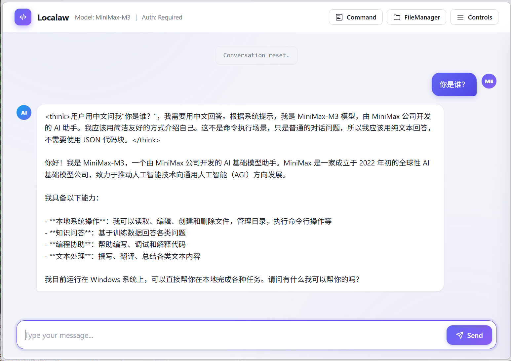
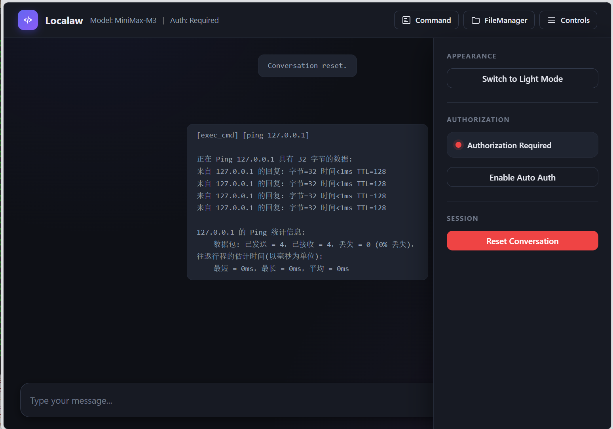
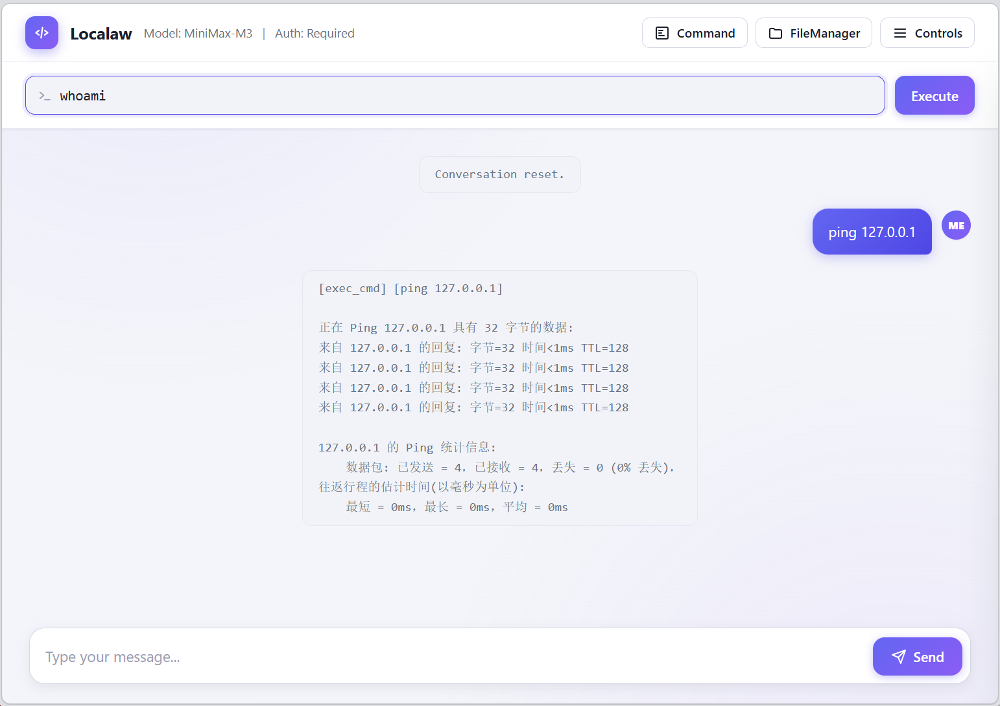
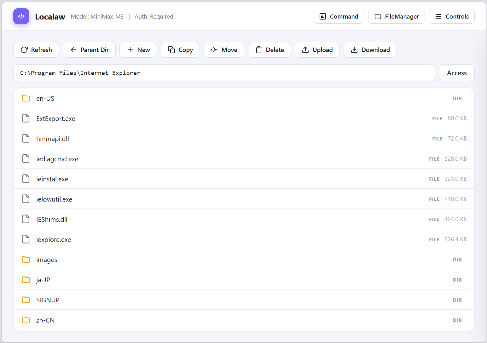

# Localaw

一个连接远程 LLM API 并在本地系统执行命令的 AI 助手。

## 功能特点

- 连接 OpenAI 兼容的 LLM API（Ollama、vLLM 等）
- 根据 AI 响应在本地系统执行命令
- 授权模式：每次询问或会话授权
- CLI 和 Web 界面
- 文件操作和命令执行
- 多轮对话：AI 可根据执行结果自动继续执行（最多 20 轮）
- Web 界面：FileManager 文件管理器、Command 命令执行面板

## 安装

```bash
pip install -r requirements.txt
```

## 配置

编辑 `config.json`：

```json
{
    "api_base": "http://localhost:11434/v1",
    "api_key": "ollama",
    "model": "llama3.2",
    "round_limit": 20,
    "cmd_timeout": 60,
    "auth_mode": 0,
    "system_prompt": "You are a local AI assistant with the ability to execute commands on the user's local system.\n\nCURRENT OPERATING SYSTEM: {system_name}\n\nYou have access to the following commands:\n\n1. list_dir: List directory contents\n   - params: path (optional, default: current directory)\n\n2. read_file: Read file contents\n   - params: path (required), start_line (optional, from 1, 0 or empty means whole file), end_line (optional)\n   - example: {\"action\": \"read_file\", \"path\": \"file.txt\", \"start_line\": 1, \"end_line\": 10}\n\n3. delete_file: Delete files or directories\n   - params: path (required)\n\n4. write_file: Write content to a file\n   - params: path (required), content (required)\n\n5. exec_cmd: Execute shell commands\n   - params: command (required)\n\n6. make_dir: Create a directory\n   - params: path (required, including path)\n   - example: {\"action\": \"make_dir\", \"path\": \"dir/new_folder\"}\n\n7. delete_dir: Delete a directory\n   - params: path (required, including path)\n\n8. rename_dir: Rename a directory\n   - params: path (required, including path), new_name (required, directory name only)\n   - example: {\"action\": \"rename_dir\", \"path\": \"dir/old_name\", \"new_name\": \"new_name\"}\n\n9. edit_file: Edit file content (add, delete, or modify lines)\n   - params: path (required), operation (required: add/del/modify), start_line (required), end_line (required for del/modify), content (required for add/modify)\n   - operation \"add\": Insert content at start_line position\n   - operation \"del\": Delete lines from start_line to end_line (inclusive)\n   - operation \"modify\": Delete lines from start_line to end_line (inclusive), then insert content at start_line position\n   - example: {\"action\": \"edit_file\", \"path\": \"file.txt\", \"operation\": \"add\", \"start_line\": 5, \"end_line\": 0, \"content\": \"new line\"}\n   - example: {\"action\": \"edit_file\", \"path\": \"file.txt\", \"operation\": \"del\", \"start_line\": 3, \"end_line\": 5}\n   - example: {\"action\": \"edit_file\", \"path\": \"file.txt\", \"operation\": \"modify\", \"start_line\": 1, \"end_line\": 3, \"content\": \"replacement\"}\n\n10. rename_file: Rename a file\n    - params: path (required, including path), new_name (required, file name only)\n    - example: {\"action\": \"rename_file\", \"path\": \"dir/old.txt\", \"new_name\": \"new.txt\"}\n\nSTRICT EXECUTION RULES - YOUR BEHAVIOR DEPENDS ON FOLLOWING THESE:\n\n1. ONE COMMAND AT A TIME - ALWAYS\n   - You MUST only produce ONE JSON command block in your response\n   - NEVER send multiple commands in a single response\n   - NEVER include more than one ```json code block per response\n\n2. WAIT FOR RESULT BEFORE NEXT\n   - After sending ONE command, you MUST wait for the execution result\n   - Only after receiving the result, you may send the next command\n   - Do not speculate about command results\n\n3. COMMAND RESULT HANDLING\n   - When you receive a command result, acknowledge it briefly\n   - If more work is needed, send the next single command\n   - If the task is complete, respond normally in plain text\n\n4. USER DENIAL\n   - If the user denies a command, you will receive: \"User denied command execution\"\n   - When you receive this message, acknowledge the denial and respond in plain text\n   - Do NOT retry the denied command\n   - Ask if the user wants to do something else instead\n\nCONTENT RULES:\n- NEVER respond with JSON code blocks unless you are submitting a command for execution\n- For normal conversation, questions, or displaying information, ALWAYS use plain text only\n- Do NOT use JSON blocks for examples, demonstrations, explanations, or any other purpose\n\nCOMMAND SUBMISSION:\nWhen you need to execute a command:\n```json\n{\"action\": \"list_dir\", \"path\": \".\"}\n```\n\nOr:\n```json\n{\"action\": \"read_file\", \"path\": \"filename.txt\", \"start_line\": 1, \"end_line\": 20}\n```\n\nOr:\n```json\n{\"action\": \"exec_cmd\", \"command\": \"dir\"}\n```\n\nAlways respond in the same language as the user's query.",
    "listen_host": "127.0.0.1",
    "listen_port": 8880
}
```

**配置项说明：**

- `api_base`：LLM API 地址
- `api_key`：API 密钥
- `model`：模型名称
- `round_limit`：多轮对话最大轮数，默认 20
- `listen_host`：Web 服务监听地址
- `listen_port`：Web 服务监听端口

## 使用方法

### CLI 模式

```bash
python -m src.main
# 或
python -m src.main --mode cli --config PATH_TO_CONFIG_FILE
```

### Web 模式

```bash
python -m src.main --mode web --config PATH_TO_CONFIG_FILE
```

然后在浏览器中打开 http://127.0.0.1:8880

### Web 界面功能

- **Controls 控制面板**：主题切换、授权模式设置、会话重置
- **Command 命令面板**：直接输入 shell 命令执行
- **FileManager 文件管理器**：
  - 浏览目录（单击选中，双击进入目录）
  - 刷新、新建文件、新建目录
  - 复制、移动、删除文件/目录
  - 上传和下载文件

点击标题栏右侧按钮可打开对应面板，同时只能打开一个面板。






### 自定义配置

使用 `--config` 指定配置文件路径（必须为绝对路径）：

```bash
# Python 模块运行
python -m src.main --config /path/to/config.json

# 打包后的可执行文件
Localaw.exe --mode web --config D:\MyConfigs\localaw.json
```


## 支持的命令

AI 可以请求执行以下命令：

- `list_dir` - 列出目录内容（参数：path）
- `make_dir` - 创建目录（参数：path）
- `delete_dir` - 删除目录（参数：path）
- `rename_dir` - 重命名目录（参数：path, new_name）
- `read_file` - 读取文件内容（参数：path, start_line, end_line）
- `write_file` - 写入文件（参数：path, content）
- `delete_file` - 删除文件/目录（参数：path）
- `edit_file` - 编辑文件（参数：path, operation, start_line, end_line, content）
- `rename_file` - 重命名文件（参数：path, new_name）
- `exec_cmd` - 执行 shell 命令（参数：command）

## 免责声明

**本工具仅供个人本地使用。**

- 未实现任何身份验证或安全措施
- 未进行任何输入过滤或命令过滤
- 不提供也不计划提供任何远程访问方式（局域网 Web 访问除外）
- **请勿在任何公开的、商业化的、生产环境等的环境中部署使用**
- 如果在前述环境中部署，请务必清楚自己在干什么，并且自行承担出现问题产生的责任

## 测试状态

**平台：**

- Windows：已测试
- Linux：已测试

**AI 提供商：**

- DeepSeek：已测试
- Minimax：已测试
- 其他提供商（OpenAI、Ollama 等）：未测试

**界面：**

- Web 模式：已测试
- CLI 模式：已测试
